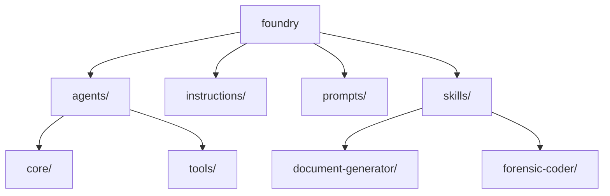

# MacroFlow Concept of Operations and Architecture Decision Records

This document serves as a comprehensive guide to MacroFlow, a structured methodology for developing AI agents and prompts within the Luna Foundry ecosystem. Its intent is to provide a clear framework for ensuring consistency, alignment with Grok xAI principles, and high-quality outputs in Acornsoft projects. The document contains a detailed Concept of Operations (ConOps) outlining MacroFlow's purpose, operational phases, constraints, and integration points, alongside integrated Architecture Decision Records (ADRs) that capture key design decisions following the format from [adr.github.io](https://adr.github.io). For technical implementation details on using Markdown and JSON in the Luna Foundry, see [Luna-Foundry-Technical-Implementation.md](Luna-Foundry-Technical-Implementation.md).

The primary audience includes Acornsoft developers, AI engineers, project managers, and stakeholders involved in client-based analysis and solution development. To leverage this document for client-based analysis, users should first review the ConOps to understand MacroFlow's operational context, then apply the structured phases to break down client requirements into actionable development tasks. For solution development, focus on the key features such as the six-phase process (Constitution, Clarify, Specify, Plan, Tasks, Implement), Grok xAI integration for reliable AI outputs, and support for production-grade code generation in C# and Python. Leverage the `src/foundry` folder for organizing custom agents, instructions, prompts, and skills aligned with VS Code Copilot standards, enabling rapid prototyping and deployment of client-tailored AI solutions. For example, use skills like the Forensic Coder for comprehensive codebase analysis during Clarify or Specify phases, or the Document Generator for creating branded client deliverables in the Implement phase. Agents provide interactive assistance, while skills bundle specialized tools for task-oriented workflows.

## Concept of Operations

### 1. Introduction

- **Purpose**: MacroFlow is a structured process for developing AI agents and
prompts in the Luna Foundry, ensuring consistency, alignment with Grok xAI
constraints, and high-quality outputs for Acornsoft projects. It now incorporates
a dedicated `src/foundry` folder for hosting custom agents, instructions, prompts,
and skills, aligned with VS Code Copilot customization standards.
- **Scope**: MacroFlow covers the full lifecycle of agent and prompt development,
including phases from Constitution to Implement, integration with Grok xAI, and
production-grade code generation for C# and Python. It extends to organizing
and deploying custom agents using Markdown for definitions and JSON for
structured integrations.
- **Applicability**: Used by Acornsoft developers and AI engineers when building
new Sherpa Agents, domain-specific prompts, or experimental patterns in the
Foundry. Now includes setup for VS Code Copilot agents and skills.
- **References**: instructions.md, README.md, Conversation-001.md, VS Code Copilot
customization docs.

### 2. Operational Concept

- **Current Situation**: Previous development of prompts and agents was ad-hoc,
leading to inconsistencies, drift from Grok xAI capabilities, and integration
issues. Recent iterations have established a hybrid structure using Markdown
for agents and JSON for tools.
- **Desired Situation**: A standardized, Grok-native process that produces
reliable, reusable patterns for AI applications, with clear separation between
development in `src/foundry` and deployment to local `~/.github` for testing.
- **Operational Scenarios**: [Describe typical use cases, e.g., developing a new
  Sherpa Agent.]
  - Scenario 1: Building a new CRM Sherpa Agent using MacroFlow phases.
  - Scenario 2: Refining an existing prompt pattern for Python code generation.
  - Scenario 3: Creating and deploying custom agents in `src/foundry` for VS Code
    Copilot, iterating through phases for alignment.

### 3. System Characteristics

- **User Characteristics**: AI engineers and developers familiar with prompt
engineering, VS Code, and .NET/C# environments. Now requires knowledge of
Copilot customization (Markdown agents, Agent Skills).
- **Operational Environment**: Operates within VS Code, integrated with xAI tools,
GitHub for versioning, and Azure for hosting (e.g., Functions). Includes local
deployment to `~/.github` for agent testing.
- **Support Environment**: Tools include Grok API, Azure Functions, Cosmos DB,
PowerShell scripts for conversion, and VS Code Copilot for agent validation.

### Foundry Directory Structure

The following section provides a visual representation of the `src/foundry` directory structure, designed to clarify the organization and intent of each folder within the Luna Foundry. This diagram and explanations ensure developers can quickly understand the layout, facilitating efficient navigation and contribution to MacroFlow-based projects. The structure emphasizes modularity, with clear separation between agents (interactive assistants), instructions (guidance), prompts (reusable queries), and skills (specialized capabilities).

### Folder Explanations and Intent

- **agents/**: Contains interactive AI assistants (Sherpa Agents) for VS Code Copilot integration. Intent: Enable conversational, role-based guidance during MacroFlow phases, with subfolders for core ritual agents and specialized tools.
  - **Luna.agent.md**: Main orchestrator for MacroFlow, invoking sub-agents.
  - **core/**: Houses the six MacroFlow phase agents (Constitution to Implement), providing structured ritual support.
  - **tools/**: Specialized agents for domain-specific tasks (e.g., AI engineering, Azure architecture), enhancing analysis and implementation.

- **instructions/**: Stores detailed guidance documents for MacroFlow phases and core systems. Intent: Provide human-readable instructions for developers, ensuring consistent application of Luna's principles and processes.

- **prompts/**: Holds reusable JSON prompt files for Grok API interactions. Intent: Standardize AI queries for each MacroFlow phase, enabling reliable, structured outputs without manual crafting.

- **skills/**: Bundles specialized capabilities as self-contained modules. Intent: Offer reusable tools for complex tasks like code analysis or document generation, integrating with agents for enhanced functionality.
  - **document-generator/**: Skill for creating branded client deliverables (e.g., DOCX, PDF) with Mermaid support.
  - **forensic-coder/**: Skill for comprehensive codebase analysis (security, performance, design).

### 4. Constraints

- **Technical Constraints**: Grok-only stack, no external tools beyond xAI, C#
primacy, strict code formatting rules. Agents use Markdown for definitions,
JSON for MCP/tools integrations.
- **Operational Constraints**: Phases must be followed in order; temperature
settings fixed for code (0.3) and creative (0.7). Development occurs in
`src/foundry`, with deployment as a separate sync step.
- **Assumptions**: Users have access to Grok API and are aligned with Acornsoft's
Grok-native manifesto. VS Code Insiders is used for Agent Skills preview.

### 5. Summary of Impacts

- **Operational Impacts**: Streamlines development, reduces inconsistencies,
enables faster iteration on AI patterns. Adds agent customization for VS Code.
- **Organizational Impacts**: Enhances Acornsoft's AI capabilities, supports
public domain releases on GitHub. Facilitates portable skills across tools.

## High-Level Plan for Luna Prompt Foundry

The high-level plan applies MacroFlow to the complete implementation of Luna Prompt Foundry, ensuring dynamic orchestration of AI prompts across modalities (Grok Desktop, VS Code, VS 2026). It focuses on embedding MacroFlow as the core ritual for consistency, with phases driving from constitution to implementation. Informed by recent research (Conversation-003.md), it incorporates agent skills for VS Code Copilot integration and CLI workflows.

1. **Constitution**: Load Acornsoft manifesto, Grok-native constraints, and project context for Luna Foundry.
2. **Clarify**: Identify requirements for Copilot integration, app sync, and Markdown-driven schemas, using parallel skills like Constitution and Clarify agents.
3. **Specify**: Define functional specs (e.g., .github/copilot-instructions.md, sync schemas, agent skills) and non-functional (secure, low-latency).
4. **Plan**: Choose vertical slice architecture (Markdown-first, Function for scale), ADR-style trade-offs, leveraging skills for orchestration.
5. **Tasks**: Break into user stories (e.g., "As a developer, integrate MacroFlow into Copilot via skills").
6. **Implement**: Generate C# code for Azure Function, Markdown files for instructions, agents, prompts, and skills.

## Detailed Plan: Markdown-Focused Tasks

This detailed plan outlines a series of tasks centered on Markdown development for Luna Prompt Foundry, prioritizing quick wins in Copilot customization and sync schemas before scaling to code. Updated with insights from Conversation-003.md to include agent skills creation.

1. **Task 1: Create .github/copilot-instructions.md** - Draft and commit the file with MacroFlow phases, personality, and constraints from Luna-Prompt-Foundry.md, ensuring neutral phrasing to avoid Grok refusals.
2. **Task 2: Develop Sync Schema Markdown** - Create Markdown documents defining JSON schemas for shared state (e.g., sessionId, phases, context) to enable app collaboration.
3. **Task 3: Outline Azure Function Mods in Markdown** - Document required changes (e.g., add HttpClient for Grok API polling) in a spec file, keeping implementation light.
4. **Task 4: Create Core Agent Skills** - Develop SKILL.md files for recommended skills: Project Planner, Code Analyzer, Code Generator, Unit Tester, Refactor/Optimizer, Debugger/Fixer, Documenter in .github/skills/.
5. **Task 5: Update Agents, Instructions, Prompts** - Integrate MacroFlow references into agents/ (e.g., Luna.agent.md, core/ phases), instructions/ (phase guides), prompts/ (JSON for phases).
6. **Task 6: Test and Iterate Markdown in Copilot** - Commit changes, reload VS Code, and test queries to validate MacroFlow enforcement via skills.
7. **Task 7: Document Baseline Requirements** - Add a Markdown section summarizing importance, fitting into Acornsoft ecosystem for unified AI workflows.

## Insights from Recent Research Conversation (Conversation-003.md)

This section summarizes key insights from Conversation-003.md, a discussion on accelerating a competitive AI coding demo in VS Code using MacroFlow and agent skills.

- **Agentic Architecture**: Propose layering custom agents on GitHub Copilot, shifting instructions/prompts to modular skills, with MacroFlow as the orchestrator engine for CLI-based workflows.
- **Demo Acceleration**: Use Yeoman for VS Code extension scaffolding, AI Toolkit for prototyping agents/models, and focus on iterative testing with Copilot Chat.
- **Agent Skills Standard**: Skills in .github/skills/ with SKILL.md (YAML metadata + instructions), evolving from individual to team/org scale.
- **Recommended Initial Skills**: Project Planner (orchestrator), Code Analyzer, Code Generator, Unit Tester, Refactor/Optimizer, Debugger/Fixer, Documenter—forming the MacroFlow backbone.
- **MacroFlow Phases**: Constitution (set principles/guardrails) and Clarify (understand request) as parallel first steps, feeding into downstream phases.
- **Integration Tips**: Test in VS Code Insiders, use local models for speed, evolve skills.md organically.

These insights align with Luna Foundry's focus on Markdown-driven agents and skills for VS Code Copilot compliance.

## Architecture Decision Records

ADRs are external documents following the format from
[adr.github.io](https://adr.github.io). The table below summarizes associated ADRs
in reverse chronological order (newest first).

| Date | Number | Title | Status | File |
| ------ | -------- | ------- | -------- | ------ |
| 2026-01-06 | 011 | Establish Markdown-Driven Sync Schemas for App Collaboration | Accepted | adr-011.md |
| 2026-01-06 | 010 | Implement Baseline Azure Function for Cross-App Sync | Accepted | adr-010.md |
| 2026-01-06 | 009 | Integrate MacroFlow into GitHub Copilot via Repo Instructions | Accepted | adr-009.md |
| 2026-01-03 | 008 | Make Skills Compliant with VS Code Agent Skills Standard | Accepted | adr-008.md |
| 2026-01-03 | 007 | Refine Document Generation Skill via Eat-Your-Own-Dog-Food Approach | Accepted | adr-007.md |
| 2026-01-03 | 006 | Document Foundry Directory Structure with Mermaid Diagram | Accepted | adr-006.md |
| 2026-01-03 | 005 | Add Document Generator Skill for Branded Deliverables | Accepted | adr-005.md |
| 2026-01-03 | 004 | Add Forensic Coder Skill for Codebase Analysis | Accepted | adr-004.md |
| 2026-01-03 | 003 | Adopt Hybrid Markdown/JSON for Agents | Accepted | adr-003.md |
| 2026-01-03 | 002 | Separate Development and Deployment for Agents | Accepted | adr-002.md |
| 2026-01-01 | 001 | Adopt MacroFlow Phases | Accepted | adr-001.md |

### ADR [Number]: [Title]

**Date**: [YYYY-MM-DD]  
**Status**: [Proposed | Accepted | Rejected | Deprecated]  
**Context**: [Background and context for the decision.]  
**Decision**: [The decision made.]  
**Consequences**: [Positive and negative outcomes.]  

---

### Example ADR 001: Adopt MacroFlow Phases

**Date**: 2026-01-01  
**Status**: Accepted  
**Context**: The Luna Foundry requires a structured process for developing prompts
and agents to ensure consistency and alignment with Grok xAI constraints.
Previous ad-hoc methods led to inconsistencies.
**Decision**: Implement MacroFlow with six phases: Constitution, Clarify,
Specify, Plan, Tasks, Implement.  
**Consequences**:

- Positive: Standardized process reduces errors and improves quality.
- Negative: May add overhead for simple tasks; requires training.

## Document Metadata

- **Version**: 1.0
- **Date**: January 6, 2026
- **Owner**: David Blaszyk (Blaze)
- **Build Tag**: 1.0.26006.1 (based on GetDayOfYear.ps1 for 2026-01-06)
- **Purpose**: Comprehensive guide to MacroFlow in Luna Foundry, including ConOps, ADRs, and plans.
- **Audience**: Acornsoft developers, AI engineers, stakeholders.
- **References**: Luna-Prompt-Foundry.md, Conversation-002.md, Conversation-003.md, adr-001.md to adr-011.md.

