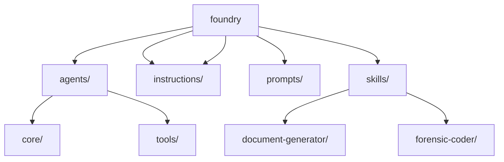
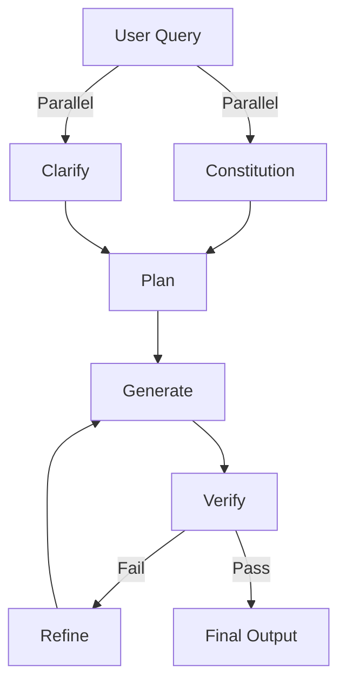
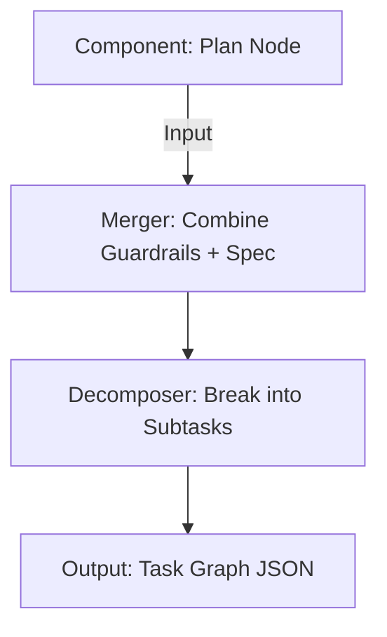
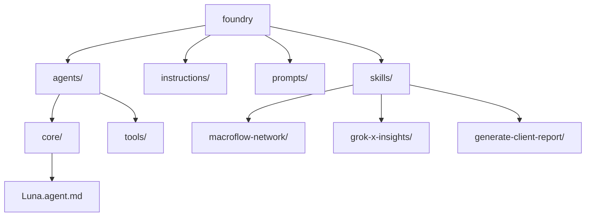

# MacroFlow Concept of Operations and Architecture Decision Records

This document serves as a comprehensive guide to MacroFlow, a structured methodology for developing AI agents and prompts within the Luna Foundry ecosystem. Its intent is to provide a clear framework for ensuring consistency, alignment with Grok xAI principles, and high-quality outputs in Acornsoft projects. The document contains a detailed Concept of Operations (ConOps) outlining MacroFlow's purpose, operational phases, constraints, and integration points, alongside integrated Architecture Decision Records (ADRs) that capture key design decisions following the format from [adr.github.io](https://adr.github.io). For technical implementation details on using Markdown and JSON in the Luna Foundry, see [Luna-Foundry-Technical-Implementation.md](Luna-Foundry-Technical-Implementation.md).

The primary audience includes Acornsoft developers, AI engineers, project managers, and stakeholders involved in client-based analysis and solution development. To leverage this document for client-based analysis, users should first review the ConOps to understand MacroFlow's operational context, then apply the structured phases to break down client requirements into actionable development tasks. For solution development, focus on the key features such as the six-phase process (Constitution, Clarify, Specify, Plan, Tasks, Implement), Grok xAI integration for reliable AI outputs, and support for production-grade code generation in C# and Python. Leverage the `src/foundry` folder for organizing custom agents, instructions, prompts, and skills aligned with VS Code Copilot standards, enabling rapid prototyping and deployment of client-tailored AI solutions. For example, use skills like the Forensic Coder for comprehensive codebase analysis during Clarify or Specify phases, or the Document Generator for creating branded client deliverables in the Implement phase. Agents provide interactive assistance, while skills bundle specialized tools for task-oriented workflows.

## Concept of Operations

### 1. Introduction

- **Purpose**: MacroFlow is a structured process for developing AI agents and
prompts in the Luna Foundry, ensuring consistency, alignment with Grok xAI
constraints, and high-quality outputs for Acornsoft projects. It now incorporates
a dedicated `src/foundry` folder for hosting custom agents, instructions, prompts,
and skills, aligned with VS Code Copilot customization standards.
- **Scope**: MacroFlow covers the full lifecycle of agent and prompt development,
including phases from Constitution to Implement, integration with Grok xAI, and
production-grade code generation for C# and Python. It extends to organizing
and deploying custom agents using Markdown for definitions and JSON for
structured integrations.
- **Applicability**: Used by Acornsoft developers and AI engineers when building
new Sherpa Agents, domain-specific prompts, or experimental patterns in the
Foundry. Now includes setup for VS Code Copilot agents and skills.
- **References**: instructions.md, README.md, Conversation-001.md, VS Code Copilot
customization docs, [Agent Skills Specification](https://agentskills.io/specification).

### 2. Operational Concept

- **Current Situation**: Previous development of prompts and agents was ad-hoc,
leading to inconsistencies, drift from Grok xAI capabilities, and integration
issues. Recent iterations have established a hybrid structure using Markdown
for agents and JSON for tools.
- **Desired Situation**: A standardized, Grok-native process that produces
reliable, reusable patterns for AI applications, with clear separation between
development in `src/foundry` and deployment to local `~/.github` for testing.
- **Operational Scenarios**: [Describe typical use cases, e.g., developing a new
  Sherpa Agent.]
  - Scenario 1: Building a new CRM Sherpa Agent using MacroFlow phases.
  - Scenario 2: Refining an existing prompt pattern for Python code generation.
  - Scenario 3: Creating and deploying custom agents in `src/foundry` for VS Code
    Copilot, iterating through phases for alignment.

### 3. System Characteristics

- **User Characteristics**: AI engineers and developers familiar with prompt
engineering, VS Code, and .NET/C# environments. Now requires knowledge of
Copilot customization (Markdown agents, Agent Skills).
- **Operational Environment**: Operates within VS Code, integrated with xAI tools,
GitHub for versioning, and Azure for hosting (e.g., Functions). Includes local
deployment to `~/.github` for agent testing.
- **Support Environment**: Tools include Grok API, Azure Functions, Cosmos DB,
PowerShell scripts for conversion, and VS Code Copilot for agent validation.

### Foundry Directory Structure

The following section provides a visual representation of the `src/foundry` directory structure, designed to clarify the organization and intent of each folder within the Luna Foundry. This diagram and explanations ensure developers can quickly understand the layout, facilitating efficient navigation and contribution to MacroFlow-based projects. The structure emphasizes modularity, with clear separation between agents (interactive assistants), instructions (guidance), prompts (reusable queries), and skills (specialized capabilities).



### Folder Explanations and Intent

- **agents/**: Contains interactive AI assistants (Sherpa Agents) designed for seamless integration with VS Code Copilot and other compatible tools. The intent is to enable conversational, role-based guidance throughout the MacroFlow phases, facilitating dynamic user interactions and automated orchestration. This folder emphasizes modularity and reusability, allowing agents to be invoked explicitly or implicitly during development workflows.
  - **Luna.agent.md**: The primary orchestrator agent for MacroFlow, responsible for initiating and coordinating the flow network. It invokes sub-agents based on user queries, ensuring alignment with Grok xAI principles and providing high-level oversight.
  - **core/**: Houses the foundational MacroFlow phase agents (Constitution, Clarify, Specify, Plan, Tasks, Implement), each providing structured support for their respective ritual steps. These agents enforce consistency, handle phase-specific logic, and integrate with the flow network for parallel execution where applicable.
  - **tools/**: Specialized agents for domain-specific tasks, such as AI engineering, Azure architecture, or client-specific analyses. These enhance the MacroFlow by offering targeted assistance, reducing manual effort, and adapting to complex scenarios like multi-agent systems or real-time integrations.

- **chatmodes/**: Stores custom chat mode configurations for Grok interactions, defining personality traits, response styles, and behavioral constraints. The intent is to tailor AI responses to specific contexts (e.g., technical vs. creative), ensuring that MacroFlow phases operate within defined modes like "Think" for reasoning or "Big Brain" for complex computations. This folder supports Grok's unique features, such as voice modes or streaming, for immersive and adaptive user experiences.

- **instructions/**: Stores detailed, human-readable guidance documents for each MacroFlow phase, core systems, and operational procedures. The intent is to provide comprehensive instructions for developers, ensuring consistent application of Luna's principles, Grok-native constraints, and best practices. These documents serve as reference materials, training aids, and integration points for agents and skills, promoting knowledge sharing and reducing onboarding time.
  - Examples include phase-specific guides (e.g., "Clarify-Phase-Instructions.md" outlining questioning strategies) and system overviews (e.g., "Grok-Integration-Guidelines.md" for API usage).

- **prompts/**: Holds reusable JSON prompt files structured for Grok API interactions, encapsulating queries, parameters, and expected outputs for each MacroFlow phase. The intent is to standardize AI queries, eliminate manual prompt crafting, and ensure reliable, structured responses aligned with Grok's modes (e.g., temperature settings, reasoning types). This folder enables portability and versioning of prompts, supporting automated phase execution and integration with the flow network.
  - Files like "constitution-prompt.json" define guardrail enforcement, while "generate-prompt.json" handles code generation with uncensored options.

- **skills/**: Bundles specialized capabilities as self-contained modules, following the [Agent Skills Specification](https://agentskills.io/specification) for portability across tools like GitHub Copilot and Claude. The intent is to offer reusable, task-oriented tools for complex operations, integrating seamlessly with agents for enhanced functionality. Skills evolve organically through git, with "Learned Patterns" sections capturing feedback and improvements, ensuring adaptability and modularity in MacroFlow implementations.
  - **document-generator/**: A skill for creating branded client deliverables (e.g., DOCX, PDF, PPTX, HTML) using Pandoc, Mermaid for diagrams, and custom templates. It processes system analysis outputs, applies branding, and generates professional reports, supporting end-to-end workflows from analysis to delivery.
  - **forensic-coder/**: A skill for comprehensive codebase analysis, including security audits, performance profiling, and design pattern identification. It reads repositories, understands logic glue (e.g., dependencies, imports), and produces detailed reports with Mermaid visualizations, aiding in Clarify and Plan phases.
  - Additional skills like **macroflow-network/** (orchestrator for the flow graph), **grok-x-insights/** (real-time X ecosystem pulls), and **generate-client-report/** (final branded output generation) extend capabilities for Grok-unique integrations and client-focused outcomes.

## Visual Diagrams and Architecture

To provide rich context for the directory structure, software design, and overall approach in Luna Foundry and MacroFlow, the following diagrams are included. These use Mermaid syntax for UML Activity Diagrams and C4 Model diagrams, offering a visual representation of workflows, system components, and architectural elements.

### UML Activity Diagram: MacroFlow Workflow

This UML Activity Diagram illustrates the dynamic flow of MacroFlow as a network, starting from user query to final output, with parallel paths, branches, and loops for verification and refinement.



### C4 Context Diagram: High-Level System Overview

This C4 Context Diagram shows Luna Foundry at the highest level, interacting with external systems like users, VS Code, GitHub, and Grok API, emphasizing the flow network as the core component.

```mermaid
graph LR
    User[User/Developer] -->|Query| MacroFlowNetwork[MacroFlow Network<br>(Luna Foundry)]
    MacroFlowNetwork -->|Skills/Agents| VSC[VS Code / Copilot]
    MacroFlowNetwork -->|Version Control| GitHub[GitHub Repo<br>(.github/skills/)]
    MacroFlowNetwork -->|AI Interactions| GrokAPI[Grok API<br>(xAI)]
    MacroFlowNetwork -->|Deliverables| Client[Client Deliverables<br>(PDF, DOCX, etc.)]
```

### C4 Container Diagram: Components Inside MacroFlow

This C4 Container Diagram details the internal containers of MacroFlow, including the Orchestrator, nodes (steps), and skills, showing how data flows between them.

```mermaid
graph LR
    Orchestrator[Container: Orchestrator Agent\n(MacroFlow Engine)] -->|Routes Flow| Nodes[Containers: Step Nodes\n(Constitution, Clarify, Plan, etc.)]
    Nodes -->|Invokes| Skills[Containers: .github/skills/\nAgents (e.g., grok-x-insights)]
    Orchestrator -->|Optimizes| Algo[Container: Flow Algorithms\n(NetworkX for max-flow)]
    Skills -->|Outputs| Deliverables[Container: Client Reports\n(via Pandoc)]
```

### C4 Component Diagram: Detailed Node Example (Plan)

This C4 Component Diagram zooms into the Plan node, showing its internal components for merging inputs, decomposing tasks, and outputting a task graph.



### Enhanced Directory Structure Diagram

Building on the earlier directory structure, this enhanced Mermaid diagram includes additional subfolders and connections to illustrate the software design and modularity.



These diagrams collectively provide a comprehensive visual context: the activity diagram shows the process flow, C4 diagrams depict the system architecture at various levels, and the enhanced directory diagram clarifies the organizational structure, ensuring developers can grasp the design and approach intuitively.

### 4. Constraints

- **Technical Constraints**: Grok-only stack, no external tools beyond xAI, C#
primacy, strict code formatting rules. Agents use Markdown for definitions,
JSON for MCP/tools integrations.
- **Operational Constraints**: Phases must be followed in order; temperature
settings fixed for code (0.3) and creative (0.7). Development occurs in
`src/foundry`, with deployment as a separate sync step.
- **Assumptions**: Users have access to Grok API and are aligned with Acornsoft's
Grok-native manifesto. VS Code Insiders is used for Agent Skills preview.

### API Development Patterns

Based on ADR-016, Luna Foundry enforces specific architectural patterns for API development to ensure scalability, security, and consistency:

- **Enterprise/Large Web API**: CQRS (Command Query Responsibility Segregation) with MediatR for command/query separation and event handling.
- **General Web API**: Minimal APIs with Repository pattern (using EF Core) and Specification pattern for flexible querying and business logic encapsulation.
- **Quick Turn API**: Azure Functions for serverless, event-driven development, with built-in security (e.g., Azure AD auth), fast deployment, and reliability (e.g., retry policies, monitoring).

These patterns are integrated into Plan and Implement phases, with agents guiding selection based on project scale.

### 5. Summary of Impacts

- **Operational Impacts**: Streamlines development, reduces inconsistencies,
enables faster iteration on AI patterns. Adds agent customization for VS Code.
- **Organizational Impacts**: Enhances Acornsoft's AI capabilities, supports
public domain releases on GitHub. Facilitates portable skills across tools.

## High-Level Plan for Luna Prompt Foundry

The high-level plan applies MacroFlow as a flow network to the complete implementation of Luna Prompt Foundry, ensuring dynamic orchestration of AI prompts across modalities (Grok Desktop, VS Code, VS 2026). It focuses on embedding MacroFlow as the core ritual for consistency, with phases driving from constitution to implementation. Informed by recent research (Conversation-003.md), it incorporates agent skills for VS Code Copilot integration, Grok unique features, and markdown-driven flow networks.

1. **Constitution**: Load Acornsoft manifesto, Grok-native constraints, and project context for Luna Foundry, setting global guardrails.
2. **Clarify**: Identify requirements for Copilot integration, app sync, and Markdown-driven schemas, using parallel skills like Constitution and Clarify agents, with Grok X insights for real-time context.
3. **Specify**: Define functional specs (e.g., .github/copilot-instructions.md, sync schemas, agent skills) and non-functional (secure, low-latency), incorporating flow network nodes and edges.
4. **Plan**: Choose vertical slice architecture (Markdown-first, Function for scale), ADR-style trade-offs, leveraging skills for orchestration and max-flow optimization.
5. **Tasks**: Break into user stories (e.g., "As a developer, integrate MacroFlow flow network into Copilot via skills").
6. **Implement**: Generate C# code for Azure Function, Markdown files for instructions, agents, prompts, and skills, including Grok-enhanced nodes like grok-x-insights and generate-client-report.

## Detailed Plan: Markdown-Focused Tasks

This detailed plan outlines a series of tasks centered on Markdown development for Luna Prompt Foundry, prioritizing quick wins in Copilot customization and sync schemas before scaling to code. Updated with insights from Conversation-003.md to include agent skills creation, flow network implementation, and Grok unique integrations.

1. **Task 1: Create .github/copilot-instructions.md** - Draft and commit the file with MacroFlow phases, personality, and constraints from Luna-Prompt-Foundry.md, ensuring neutral phrasing to avoid Grok refusals.
2. **Task 2: Develop Sync Schema Markdown** - Create Markdown documents defining JSON schemas for shared state (e.g., sessionId, phases, context) to enable app collaboration.
3. **Task 3: Outline Azure Function Mods in Markdown** - Document required changes (e.g., add HttpClient for Grok API polling) in a spec file, keeping implementation light.
4. **Task 4: Implement Flow Network Graph** - Create graph.json defining nodes (e.g., Constitution, Clarify, Plan, Generate, Verify, Refine, Grok-X-Insights), edges, and capacities for max-flow optimization.
5. **Task 5: Create Core Agent Skills** - Develop SKILL.md files for recommended skills: macroflow-network (orchestrator), grok-x-insights, uncensored-brainstorm, generate-client-report, plus core phases (constitution, clarify, plan, generate, verify, refine) in .github/skills/.
6. **Task 6: Update Agents, Instructions, Prompts** - Integrate MacroFlow flow network references into agents/ (e.g., Luna.agent.md, core/ phases), instructions/ (phase guides with network flows), prompts/ (JSON for phases with Grok modes).
7. **Task 7: Test and Iterate Markdown in Copilot** - Commit changes, reload VS Code, and test queries (e.g., "@workspace Use MacroFlow to analyze repo") to validate flow network enforcement via skills.
8. **Task 8: Document Baseline Requirements** - Add a Markdown section summarizing importance, fitting into Acornsoft ecosystem for unified AI workflows, including Grok differentiators.

## Insights from Recent Research Conversation (Conversation-003.md)

This section summarizes key insights from Conversation-003.md, a comprehensive discussion on refactoring MacroFlow into a flow network model, accelerating competitive AI coding demos in VS Code, and implementing via agent skills and markdown.

- **Flow Network Refactoring**: MacroFlow evolved from a linear 6-step ritual (Constitution, Clarify, Plan, Generate, Verify, Refine) to a dynamic graph-based system inspired by flow networks (nodes as steps, edges as data flows, capacities for limits). This enables parallelism (e.g., Constitution and Clarify in parallel), feedback loops, and optimization via max-flow algorithms (e.g., Ford-Fulkerson) to maximize useful output while minimizing waste. Explained by example (sentiment analysis app), reasoned by analogy (city water supply), and critically simplified to 4-5 core nodes for velocity.
- **Implementation via Markdown Skills**: No VS Code extension required; all built with .github/skills/ folders containing SKILL.md (YAML metadata + instructions) and optional files. Copilot discovers and invokes them natively. Includes a central macroflow-network skill for orchestration, graph.json for the network definition, and sub-skills for nodes. Evolve organically through git and feedback.
- **Grok Unique Integration**: Leveraged Grok's differentiators (real-time X ecosystem searches for trends/insights, uncensored "spicy" ideation, massive context windows, truth-seeking) over other LLMs. Added grok-x-insights skill for live pulls, uncensored-brainstorm for bold reasoning, ensuring MacroFlow is smarter and faster for AI app builds.
- **Use Cases and Skills**: Focused on 2-3 common cases: real-time trend-aware code gen, edgy debugging, and git repo system analysis (read folders, understand logic, generate Mermaid-rich docs, convert to branded PDFs/DOCX/PPTX/HTML via Pandoc + PowerShell). Recommended initial skills: Project Planner, Code Analyzer, Code Generator, Unit Tester, Refactor/Optimizer, Debugger/Fixer, Documenter, plus Grok-specific ones.
- **Final Implementation Plan**: Complete repo structure, skills files (e.g., macroflow-network/SKILL.md, graph.json), test harness (@workspace queries), deployment (push to GitHub). Added generate-client-report skill for deliverables using Pandoc, Mermaid, custom templates.

These insights drive the high-level and detailed plans, emphasizing Markdown-first development, Grok-native compliance, and skills for modularity.

## Architecture Decision Records

ADRs are external documents following the format from
[adr.github.io](https://adr.github.io). The table below summarizes associated ADRs
in reverse chronological order (newest first).

| Date | Number | Title | Status | File |
| ------ | -------- | ------- | -------- | ------ |
| 2026-01-07 | 016 | Define Key Architectural Patterns for Luna Foundry API Development | Proposed | adr-016.md |
| 2026-01-07 | 015 | Implement Azure DevOps Feature for Luna Foundry Pre-Requisites Tracking | Proposed | adr-015.md |
| 2026-01-07 | 014 | Add Transition Labels to Luna Agent for MacroFlow Guidance | Accepted | adr-014.md |
| 2026-01-06 | 013 | Integrate GitHub Repository Links in Azure DevOps Work Items | Accepted | adr-013.md |
| 2026-01-06 | 012 | Use Azure CLI for Work Item Linkage to GitHub | Accepted | adr-012.md |
| 2026-01-06 | 011 | Establish Markdown-Driven Sync Schemas for App Collaboration | Accepted | adr-011.md |
| 2026-01-06 | 010 | Implement Baseline Azure Function for Cross-App Sync | Accepted | adr-010.md |
| 2026-01-06 | 009 | Integrate MacroFlow into GitHub Copilot via Repo Instructions | Accepted | adr-009.md |
| 2026-01-03 | 008 | Make Skills Compliant with VS Code Agent Skills Standard | Accepted | adr-008.md |
| 2026-01-03 | 007 | Refine Document Generation Skill via Eat-Your-Own-Dog-Food Approach | Accepted | adr-007.md |
| 2026-01-03 | 006 | Document Foundry Directory Structure with Mermaid Diagram | Accepted | adr-006.md |
| 2026-01-03 | 005 | Add Document Generator Skill for Branded Deliverables | Accepted | adr-005.md |
| 2026-01-03 | 004 | Add Forensic Coder Skill for Codebase Analysis | Accepted | adr-004.md |
| 2026-01-03 | 003 | Adopt Hybrid Markdown/JSON for Agents | Accepted | adr-003.md |
| 2026-01-03 | 002 | Separate Development and Deployment for Agents | Accepted | adr-002.md |
| 2026-01-01 | 001 | Adopt MacroFlow Phases | Accepted | adr-001.md |

### ADR [Number]: [Title]

**Date**: [YYYY-MM-DD]  
**Status**: [Proposed | Accepted | Rejected | Deprecated]  
**Context**: [Background and context for the decision.]  
**Decision**: [The decision made.]  
**Consequences**: [Positive and negative outcomes.]  

---

### Example ADR 001: Adopt MacroFlow Phases

**Date**: 2026-01-01  
**Status**: Accepted  
**Context**: The Luna Foundry requires a structured process for developing prompts
and agents to ensure consistency and alignment with Grok xAI constraints.
Previous ad-hoc methods led to inconsistencies.
**Decision**: Implement MacroFlow with six phases: Constitution, Clarify,
Specify, Plan, Tasks, Implement.  
**Consequences**:

- Positive: Standardized process reduces errors and improves quality.
- Negative: May add overhead for simple tasks; requires training.

## Document Metadata

- **Version**: 1.1
- **Date**: January 7, 2026
- **Owner**: David Blaszyk (Blaze)
- **Build Tag**: 1.0.26007.1 (based on GetDayOfYear.ps1 for 2026-01-07)
- **Purpose**: Comprehensive guide to MacroFlow in Luna Foundry, including ConOps, ADRs, and plans.
- **Audience**: Acornsoft developers, AI engineers, stakeholders.
- **References**: Luna-Prompt-Foundry.md, Conversation-002.md, Conversation-003.md, adr-001.md to adr-016.md.

