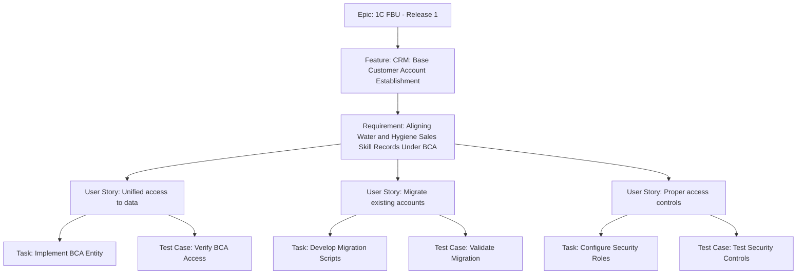

# Sample Work Item Breakdown: Base Customer Account Establishment (Release 1)

**Note:** This sample demonstrates a complete hierarchical structure. You can start with any work item type and build dependencies as needed. Use the "Next Steps" sections below to guide adding child work items to existing structures.

## Summary Table

| Work Item Type | Title | State | Assigned To |
| ---------------- | ------- | ------- | ------------- |
| Epic | 1C FBU - Release 1 | New | Siva Yellapantula |
| Feature | CRM: Base Customer Account Establishment | New | Siva Yellapantula |
| Requirement | Aligning Water and Hygiene Sales Skill Records Under BCA | New | Requirements Analyst |
| User Story | As a sales representative, I want unified access to Water and Hygiene data under one Base Customer Account so that I can manage customer relationships efficiently across divisions. | New | Development Team |
| User Story | As a data administrator, I want to migrate existing Water and Hygiene accounts to the BCA structure so that historical data is preserved and accessible. | New | Development Team |
| User Story | As a security officer, I want proper access controls on BCA records so that sensitive data is protected based on user roles. | New | Development Team |
| Task | Implement BCA Entity Configuration | To Do | Developer |
| Task | Develop Data Migration Scripts | To Do | Developer |
| Task | Configure Security Roles for BCA | To Do | Developer |
| Test Case | Verify BCA Access for Sales Rep | Design | QA Team |
| Test Case | Validate Data Migration Accuracy | Design | QA Team |
| Test Case | Test Security Access Controls | Design | QA Team |

## Hierarchy Diagram

## Detailed Breakdown

**Title:** CRM: Base Customer Account Establishment  
**Description:** Establish a dedicated Base Customer Account entity in CRM to support the One Customer model for Canada accounts. This includes creating a centralized BCA structure that aligns sales skill records (e.g., Water and Hygiene) under a single account for unified customer management.  
**Tags:** CRM; Data; Integration  
**State:** New  
**Assigned To:** Siva Yellapantula  

**Next Steps:**  
- Create Requirement: Specify technical details (e.g., Aligning Water and Hygiene Sales Skill Records Under BCA).  
- Add User Stories directly if requirements are clear.  
- Link to parent Epic.  

## Requirement

**Title:** Aligning Water and Hygiene Sales Skill Records Under BCA  
**Description:** Ensure that Water and Hygiene sales skill records are properly aligned under the Base Customer Account with correct security, filtering, and metadata visibility. This involves updating CRM configurations to support merged site logic and downstream compatibility with PowerApps and Power BI.  
**Tags:** CRM; Requirements  
**State:** New  
**Assigned To:** Requirements Analyst  

**Next Steps:**  
- Create User Story: Break down into user-focused functionality (e.g., unified access, data migration, security controls).  
- Add Tasks if implementation details are known.  
- Link to parent Feature.  

### User Story 1: Unified Access

**Title:** As a sales representative, I want unified access to Water and Hygiene data under one Base Customer Account so that I can manage customer relationships efficiently across divisions.  
**Description:** As a sales representative within global water or hygiene, I want to access all customer data (contacts, opportunities, service history) under a single Base Customer Account so that I can provide seamless service and avoid data silos.  

**Acceptance Criteria:**  

- I can view all Water and Hygiene records linked to the BCA.  
- Security filters apply correctly based on my sales skill.  
- Metadata visibility is consistent across divisions.  

**Tags:** User Story; CRM  
**State:** New  
**Assigned To:** Development Team  

**Next Steps:**  
- Create Task: Define implementation work (e.g., Implement BCA Entity Configuration).  
- Create Test Case: Plan validation (e.g., Verify BCA Access for Sales Rep).  
- Link to parent Requirement or Feature.  

### User Story 2: Data Migration

**Title:** As a data administrator, I want to migrate existing Water and Hygiene accounts to the BCA structure so that historical data is preserved and accessible.  
**Description:** As a data administrator, I want to run automated scripts to merge Water and Hygiene account data into the new BCA entity so that no data is lost during the transition.  

**Acceptance Criteria:**  

- Migration scripts handle data conflicts appropriately.  
- Historical records are linked correctly to BCA.  
- Migration process is reversible if needed.  

**Tags:** User Story; CRM; Data  
**State:** New  
**Assigned To:** Development Team  

**Next Steps:**  
- Create Task: Develop migration scripts.  
- Create Test Case: Validate data accuracy.  
- Link to parent Requirement.  

### User Story 3: Security Controls

**Title:** As a security officer, I want proper access controls on BCA records so that sensitive data is protected based on user roles.  
**Description:** As a security officer, I want role-based permissions configured for BCA access so that users only see data relevant to their responsibilities.  

**Acceptance Criteria:**  

- Roles are defined for Water, Hygiene, and combined access.  
- Permissions are enforced at the record level.  
- Audit logs capture access attempts.  

**Tags:** User Story; CRM; Security  
**State:** New  
**Assigned To:** Development Team  

**Next Steps:**  
- Create Task: Configure security roles.  
- Create Test Case: Test access controls.  
- Link to parent Requirement.  

### Task 1: BCA Entity Configuration

**Title:** Implement BCA Entity Configuration  
**Description:** Configure the Base Customer Account entity in CRM with necessary fields and relationships.  
**Remaining Work:** 16 hours  
**State:** To Do  
**Assigned To:** Developer  

**Next Steps:**  
- Create Test Case: Validate the configuration.  
- Link to parent User Story.  

### Task 2: Data Migration Scripts

**Title:** Develop Data Migration Scripts  
**Description:** Create scripts to migrate existing account data to BCA structure.  
**Remaining Work:** 20 hours  
**State:** To Do  
**Assigned To:** Developer  

**Next Steps:**  
- Create Test Case: Validate migration.  
- Link to parent User Story.  

### Task 3: Security Roles Configuration

**Title:** Configure Security Roles for BCA  
**Description:** Set up role-based security for BCA access.  
**Remaining Work:** 12 hours  
**State:** To Do  
**Assigned To:** Developer  

**Next Steps:**  
- Create Test Case: Test security.  
- Link to parent User Story.  

### Test Case 1: BCA Access Verification

**Title:** Verify BCA Access for Sales Rep  

**Steps:**  

1. Login as Water sales rep.  
2. Navigate to BCA record.  
3. Verify Water and Hygiene data visibility.  

**Expected Result:** All relevant data displays correctly with proper security.  
**State:** Design  
**Assigned To:** QA Team  

**Next Steps:**  
- Link to parent User Story or Task.  
- Execute when implementation is ready.  

### Test Case 2: Data Migration Validation

**Title:** Validate Data Migration Accuracy  

**Steps:**  

1. Run migration script on test data.  
2. Compare source and target data.  
3. Check for data integrity.  

**Expected Result:** All data migrates correctly without loss.  
**State:** Design  
**Assigned To:** QA Team  

**Next Steps:**  
- Link to parent User Story or Task.  
- Run after migration scripts are developed.  

### Test Case 3: Security Controls Testing

**Title:** Test Security Access Controls  

**Steps:**  

1. Assign different roles to test users.  
2. Attempt access to BCA records.  
3. Verify permissions are enforced.  

**Expected Result:** Users can only access authorized data.  
**State:** Design  
**Assigned To:** QA Team
