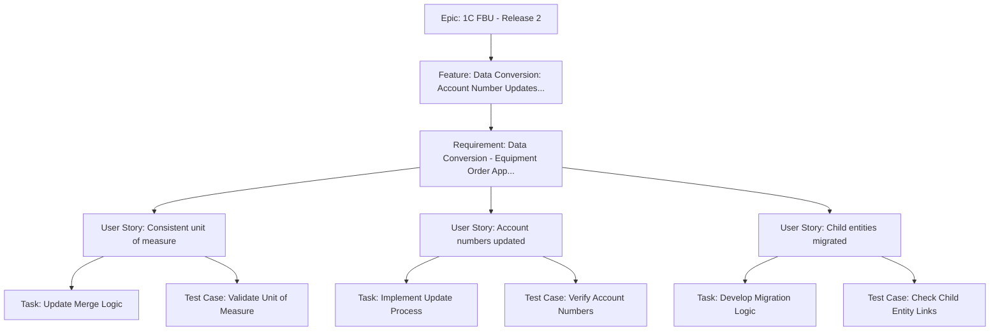

# Sample Work Item Breakdown: Data Conversion for Equipment Ordering (Release 2)

**Note:** This sample demonstrates a complete hierarchical structure. You can start with any work item type and build dependencies as needed. Use the "Next Steps" sections below to guide adding child work items to existing structures.

## Summary Table

| Work Item Type | Title | State | Assigned To |
| ---------------- | ------- | ------- | ------------- |
| Epic | 1C FBU - Release 2 | New | Chau Nguyen |
| Feature | Data Conversion: Account Number Updates, Child Entity Migrations, Field Updates | New | Chau Nguyen |
| Requirement | Data Conversion - Equipment Order App - Unit of Measure & Billing Systems | New | Requirements Analyst |
| User Story | As a system administrator, I want consistent unit of measure data during account merges so that billing calculations are accurate and reliable. | New | Development Team |
| User Story | As a data analyst, I want account numbers updated automatically during merges so that reporting remains consistent. | New | Development Team |
| User Story | As an operations manager, I want child entities migrated correctly so that related records stay linked. | New | Development Team |
| Task | Update Merge Logic for Unit of Measure | To Do | Developer |
| Task | Implement Account Number Update Process | To Do | Developer |
| Task | Develop Child Entity Migration Logic | To Do | Developer |
| Test Case | Validate Unit of Measure Post-Merge | Design | QA Team |
| Test Case | Verify Account Number Updates | Design | QA Team |
| Test Case | Check Child Entity Links | Design | QA Team |

## Hierarchy Diagram

## Detailed Breakdown
**Title:** Data Conversion: Account Number Updates, Child Entity Migrations, Field Updates  
**Description:** Perform data conversion for USA accounts to support One Customer structure, including updating account numbers, migrating child entities, and ensuring field consistency during merges.  
**Tags:** CRM; Data  
**State:** New  
**Assigned To:** Chau Nguyen  

**Next Steps:**  
- Create Feature: Define data conversion capabilities.  
- Link to existing Epics.  

## Requirement
**Title:** Data Conversion - Equipment Order App - Unit of Measure & Billing Systems  
**Description:** Maintain consistency in unit of measure and billing system during OneCustomer Account merges for the Equipment Ordering App Power App. Ensure that merged accounts retain accurate billing and measurement data.  
**Tags:** CRM; Requirements  
**State:** New  
**Assigned To:** Requirements Analyst  

## User Story
**Title:** As a system administrator, I want consistent unit of measure data during account merges so that billing calculations are accurate and reliable.  
**Description:** As a system administrator managing the Equipment Ordering App, I want the unit of measure fields to remain consistent when accounts are merged in the One Customer model so that billing systems process orders correctly without errors.  
**Acceptance Criteria:**  
- Unit of measure fields are preserved during merges.  
- Billing system references are updated automatically.  
- No data loss occurs in related entities.  
**Tags:** User Story; CRM  
**State:** New  
**Assigned To:** Development Team  

## Task
**Title:** Update Merge Logic for Unit of Measure  
**Description:** Modify the account merge process to handle unit of measure consistency.  
**Remaining Work:** 8 hours  
**State:** To Do  
**Assigned To:** Developer  

## Test Case
**Title:** Validate Unit of Measure Post-Merge  
**Steps:**  
1. Merge two accounts with different unit measures.  
2. Check Equipment Ordering App fields.  
3. Verify billing system integration.  
**Expected Result:** Unit measures are consistent and billing is accurate.  
**State:** Design  
**Assigned To:** QA Team  

**Next Steps:**  
- Link to parent User Story or Task.  
- Test after migration.
