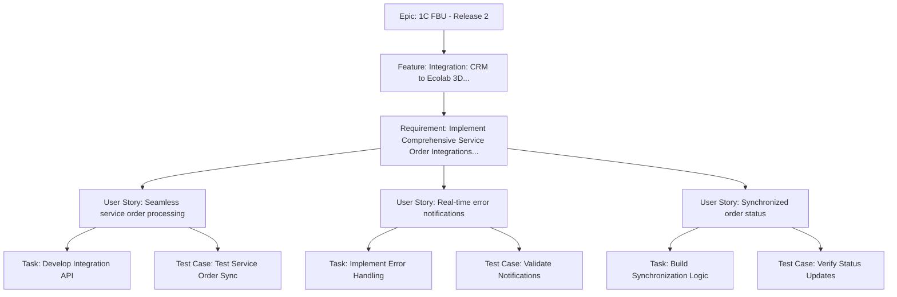

# Sample Work Item Breakdown: Service Order Integrations (Release 2)

**Note:** This sample demonstrates a complete hierarchical structure. You can start with any work item type and build dependencies as needed. Use the "Next Steps" sections below to guide adding child work items to existing structures.

## Summary Table

| Work Item Type | Title | State | Assigned To |
| ---------------- | ------- | ------- | ------------- |
| Epic | 1C FBU - Release 2 | New | David Blaszyk |
| Feature | Integration: CRM to Ecolab 3D and Ecolab 3D to CRM Integration Regression & Sanity Testing | New | David Blaszyk |
| Requirement | Implement Comprehensive Service Order Integrations Between CRM and Both NSAP and EBS SAP Systems | Active | Requirements Analyst |
| User Story | As a service manager, I want seamless service order processing during the dual ERP transition so that operations continue smoothly without disruptions. | New | Development Team |
| User Story | As a customer service rep, I want real-time error notifications for failed integrations so that issues can be resolved quickly. | New | Development Team |
| User Story | As a finance analyst, I want synchronized order status updates across systems so that financial reporting is accurate. | New | Development Team |
| Task | Develop CRM to SAP Integration API | To Do | Developer |
| Task | Implement Error Handling and Notifications | To Do | Developer |
| Task | Build Status Synchronization Logic | To Do | Developer |
| Test Case | Test Service Order Sync | Design | QA Team |
| Test Case | Validate Error Notifications | Design | QA Team |
| Test Case | Verify Status Updates | Design | QA Team |

## Hierarchy Diagram

## Detailed Breakdown
**Title:** Integration: CRM to Ecolab 3D and Ecolab 3D to CRM Integration Regression & Sanity Testing  
**Description:** Implement and test integrations between CRM and Ecolab 3D systems to support seamless service order processing during the dual ERP transition for USA accounts.  
**Tags:** CRM; Integration; Inventory  
**State:** New  
**Assigned To:** David Blaszyk  

**Next Steps:**  
- Create Feature: Define integration capabilities.  
- Link to existing Epics.  

## Requirement
**Title:** Implement Comprehensive Service Order Integrations Between CRM and Both NSAP and EBS SAP Systems  
**Description:** Enable seamless processing of service orders across CRM, NSAP, and EBS SAP systems during the dual ERP transition. Support 247 strategic global accounts, 1,203 regional key accounts, and 3,456 local standard accounts representing over $2.1B in annual service revenue.  
**Tags:** Integration; Requirements  
**State:** Active  
**Assigned To:** Requirements Analyst  

## User Story
**Title:** As a service manager, I want seamless service order processing during the dual ERP transition so that operations continue smoothly without disruptions.  
**Description:** As a service manager handling global accounts, I want service orders to integrate automatically between CRM and both NSAP and EBS SAP systems so that I can process orders efficiently across the transition period.  
**Acceptance Criteria:**  
- Orders sync between CRM and SAP systems in real-time.  
- Error handling prevents order failures.  
- Status updates are visible across systems.  
**Tags:** User Story; Integration  
**State:** New  
**Assigned To:** Development Team  

## Task
**Title:** Develop CRM to SAP Integration API  
**Description:** Build API endpoints for service order synchronization.  
**Remaining Work:** 24 hours  
**State:** To Do  
**Assigned To:** Developer  

## Test Case
**Title:** Test Service Order Sync  
**Steps:**  
1. Create order in CRM.  
2. Verify sync to NSAP and EBS.  
3. Check status updates.  
**Expected Result:** Order appears in both SAP systems with correct data.  
**State:** Design  
**Assigned To:** QA Team  

**Next Steps:**  
- Link to parent User Story or Task.  
- Validate after synchronization is built.
