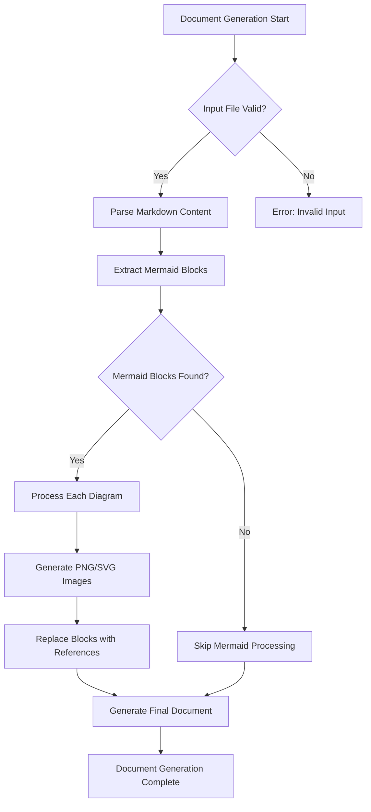
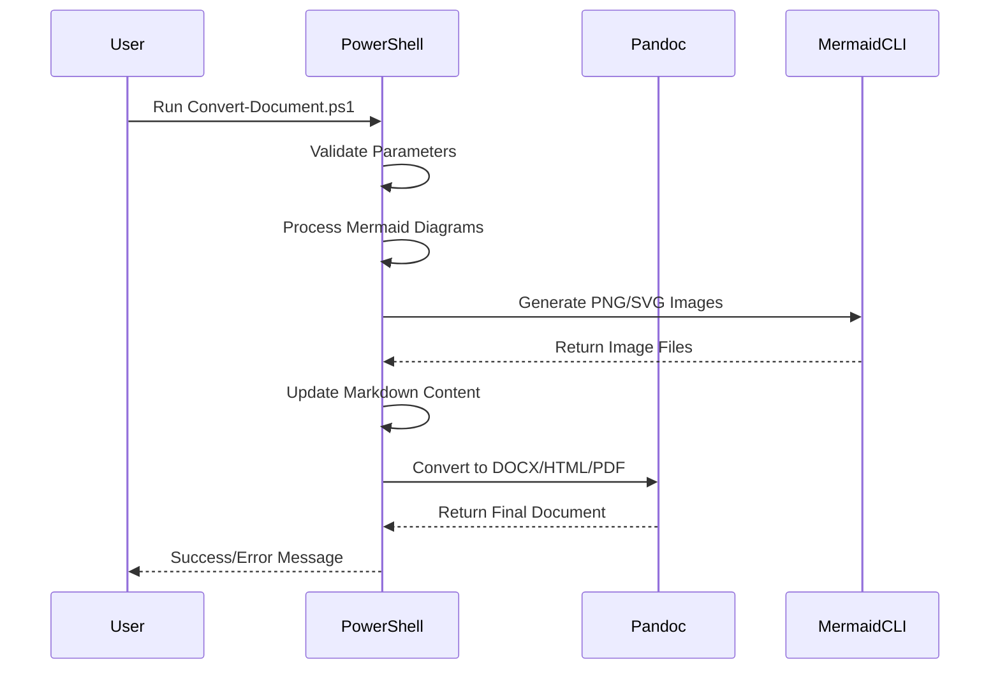
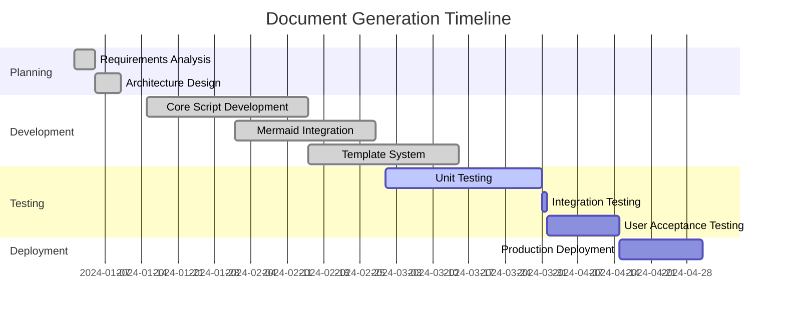
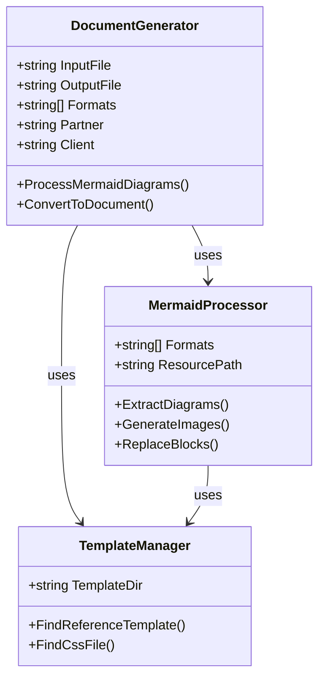
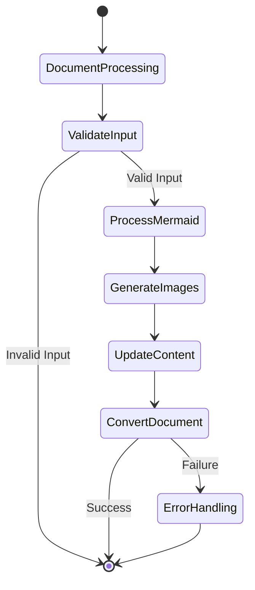
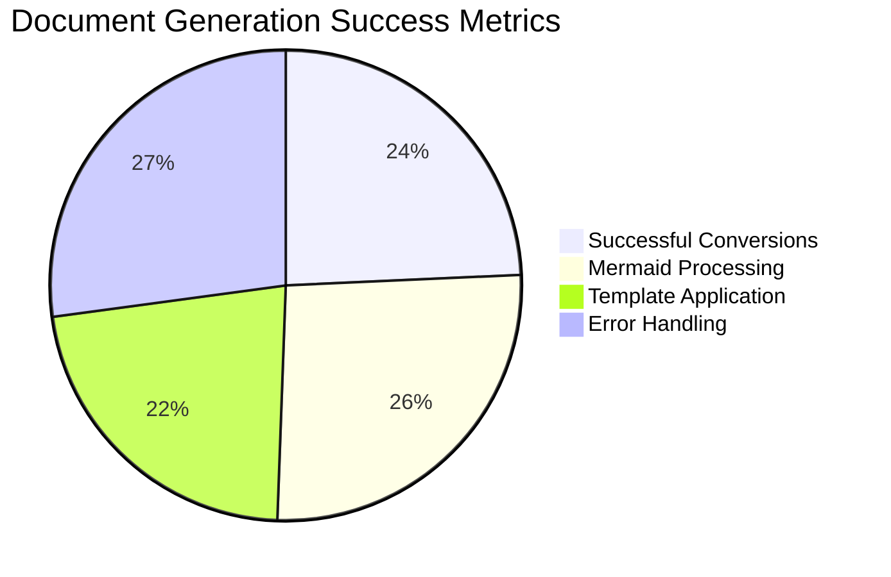

# Document Generation Setup and Testing

This directory contains tools and scripts for generating documentation from Markdown files, including support for Mermaid diagrams.

## AI-First Environment Setup (Always Latest Versions + Cleanup)

**🚀 Complete Automated Setup with Cleanup**: This project uses AI-first installation with hardcoded latest versions and automatic cleanup of old versions. Instead of manual setup or API fetching, use the AI prompts below to have an AI assistant automatically configure your environment with guaranteed latest versions, proper PATH setup, and cleanup of outdated software.

### Primary Setup Prompt (Recommended)

**Copy and paste this complete prompt to an AI assistant (Claude, GPT-4, etc.):**

```
You are an expert DevOps engineer specializing in automated software installation and cleanup on Windows 11. Set up a complete document generation environment for processing Markdown files with Mermaid diagrams, ensuring the latest hardcoded versions of all components, proper PATH priority, and cleanup of old versions.

FIRST: Check if the latest hardcoded versions are already installed before attempting any installations:
- Pandoc 3.8.2.1 - Check 'pandoc --version' and compare with 3.8.2.1
- Node.js 24.11.1 - Check 'node --version' and compare with v24.11.1
- Mermaid CLI - Check 'mmdc --version' and ensure it's the latest version

If latest versions are already installed, ensure they are prioritized in PATH and skip installation. Only install if the exact latest versions are NOT already installed.

REQUIRED COMPONENTS & LATEST HARDCODED VERSIONS:
1. Pandoc - Install version 3.8.2.1 (latest stable from GitHub) ONLY if not already at 3.8.2.1
2. Node.js - Install version 24.11.1 (latest LTS from nodejs.org) ONLY if not already at v24.11.1
3. Mermaid CLI (@mermaid-js/mermaid-cli) - Install latest version via npm ONLY if not already installed
4. Custom Office Templates directory structure with Acornsoft branding

AUTOMATED INSTALLATION & CLEANUP STEPS:
2. Download and install Pandoc 3.8.2.1 ZIP from hardcoded GitHub URL to user directory ONLY if not already at latest
3. Download and install Node.js 24.11.1 ZIP from hardcoded nodejs.org URL to user directory ONLY if not already at latest
4. Install the latest Mermaid CLI globally via npm ONLY if not already installed
5. Create directory: %USERPROFILE%\Documents\Custom Office Templates\Acornsoft\
6. Download a professional Acornsoft-style Word template and save as template.docx
7. Create a basic template.css file for HTML output with Acornsoft branding
8. ENSURE PATH PRIORITY: Add latest installation paths to beginning of user PATH
9. Clean up temporary installation files

PATH PRIORITY REQUIREMENTS:
- Latest Pandoc (C:\Users\%USERNAME%\Pandoc-3.8.2.1) must be first in PATH before any system Pandoc
- Latest Node.js (C:\Users\%USERNAME%\NodeJS-24.11.1) must be first in PATH before any system Node.js
- Latest npm global packages path must be first in PATH
- Filter out all conflicting system installation paths (Program Files nodejs, pandoc, etc.)
- Ensure no old versions can override the latest installations

CLEANUP REQUIREMENTS:
- Clean up temporary ZIP files and extraction directories
- Verify no old versions remain accessible

VERIFICATION TESTS:
- Run 'pandoc --version' and confirm exactly 3.8.2.1
- Run 'node --version' and confirm exactly v24.11.1
- Run 'npm --version' and confirm installed
- Run 'mmdc --version' and confirm latest Mermaid CLI works
- Test Mermaid diagram generation: create a simple flowchart and convert to PNG
- Test Pandoc conversion: convert a sample Markdown file to DOCX with Mermaid diagrams
- Verify cleanup: confirm no old Pandoc 3.5 or old Node.js versions remain
- Verify PATH priority: confirm latest versions are found first

PROVIDE OUTPUT:
- Single PowerShell script that checks for latest versions first, then installs only what's missing
- Hardcode the exact latest version URLs (no API calls)
- Include cleanup functionality for old versions
- Include PATH priority setup for user environment variables
- Show version information for all installed components
- Include verification that latest versions are prioritized and old versions cleaned up
- Confirm the environment is ready for document generation

The goal is zero-manual steps with guaranteed latest versions, complete cleanup of old software, and proper PATH setup - just run the generated script and have a fully working, clean environment with latest tools.
```

### Alternative Component-Specific Prompts

If the primary prompt fails or you need individual components:

#### Latest Pandoc Setup & Cleanup Prompt

```powershell
Install the absolute latest Pandoc version on Windows automatically and clean up old versions. Use hardcoded version 3.8.2.1 from GitHub releases. Remove any old Pandoc versions (especially 3.5, 3.6, 3.7), install the latest to user directory, verify 'pandoc --version' shows 3.8.2.1, and ensure it's prioritized in PATH. Provide a PowerShell script that handles installation and cleanup.
```

#### Latest Node.js & Mermaid CLI Setup & Cleanup Prompt

```powershell
Install the latest Node.js LTS and Mermaid CLI on Windows automatically, cleaning up old versions. Use hardcoded version 24.11.1 from nodejs.org, remove old Node.js versions (20.x, 21.x, 22.x, 23.x), install to user directory, then force reinstall the latest @mermaid-js/mermaid-cli via npm. Verify both 'node --version' shows v24.11.1 and 'mmdc --version' works with latest. Provide a complete PowerShell script.
```

#### Template Setup Prompt

```powershell
Create a professional document template setup for Acornsoft branding with latest best practices. Create the directory structure %USERPROFILE%\Documents\Custom Office Templates\Acornsoft\, download appropriate template files. Find a clean, professional Word document template suitable for consulting reports and save it as template.docx. Also create a basic CSS file for HTML output styling. Provide a PowerShell script that handles the complete template setup automatically.
```

### Environment Cleanup Prompt

**For cleanup of old versions without full setup:**

```powershell
Clean up old document generation tool versions on Windows completely. Remove old Pandoc versions (3.5.x, 3.6.x, 3.7.x) from all locations, old Node.js versions (20.x, 21.x, 22.x, 23.x) from all locations, force reinstall latest Mermaid CLI, and verify cleanup. Remove from Program Files, user directories, and clean PATH. Provide a PowerShell script that safely removes old versions while preserving working latest installations.
```

### Environment Verification Prompt

**After setup, verify everything works with latest versions and cleanup:**

```powershell
Verify the complete document generation environment is working with latest versions and old versions cleaned up. Run these tests:

1. Test Pandoc: pandoc --version (should be exactly 3.8.2.1)
2. Test Node.js: node --version (should be exactly v24.11.1)
3. Test Mermaid CLI: mmdc --version (latest version)
4. Test Mermaid generation: Create a test diagram and convert to PNG
6. Test document conversion: Convert a sample Markdown file to DOCX with Mermaid diagrams
7. Verify cleanup: Confirm no old Pandoc 3.5, 3.6, 3.7 or old Node.js versions remain
8. Verify PATH priority: Confirm latest versions are found first in PATH
9. Test template usage: Generate a document using the Acornsoft template

Provide a PowerShell script that runs all verification tests and reports success/failure for each component with exact version information.
```

### Quick Environment Check with Cleanup Verification

Run this PowerShell command to verify your setup with latest versions and cleanup:

```powershell
# Environment verification script with version checking and cleanup verification
Write-Host "🔍 Verifying Latest Document Generation Environment..." -ForegroundColor Cyan

$tests = @(
    @{Name = "Pandoc (3.8.2.1)"; Command = "pandoc --version"; Required = $true; VersionPattern = "pandoc\.exe (\d+\.\d+\.\d+\.\d+)"; MinVersion = "3.8.2.1"},
    @{Name = "Node.js (24.11.1 LTS)"; Command = "node --version"; Required = $true; VersionPattern = "v(\d+\.\d+\.\d+)"; MinVersion = "24.11.1"},
    @{Name = "Mermaid CLI (Latest)"; Command = "mmdc --version"; Required = $true},
    @{Name = "Acornsoft Template"; Command = "Test-Path `"`$env:USERPROFILE\Documents\Custom Office Templates\Acornsoft\template.docx`""; Required = $true}
)

$allPassed = $true
foreach ($test in $tests) {
    try {
        $result = Invoke-Expression $test.Command 2>$null
        if ($LASTEXITCODE -eq 0 -or $result) {
            $versionInfo = ""
            if ($test.VersionPattern -and $result -match $test.VersionPattern) {
                $version = $Matches[1]
                $versionInfo = " ($version)"
                if ($test.MinVersion -and [version]$version -lt [version]$test.MinVersion) {
                    Write-Host "❌ $($test.Name) - VERSION TOO OLD: $version (minimum $($test.MinVersion))" -ForegroundColor Red
                    if ($test.Required) { $allPassed = $false }
                    continue
                }
            }
            Write-Host "✅ $($test.Name) - OK$versionInfo" -ForegroundColor Green
        } else {
            Write-Host "❌ $($test.Name) - FAILED" -ForegroundColor Red
            if ($test.Required) { $allPassed = $false }
        }
    } catch {
        Write-Host "❌ $($test.Name) - ERROR: $($_.Exception.Message)" -ForegroundColor Red
        if ($test.Required) { $allPassed = $false }
    }
}

# Check for old versions that should have been cleaned up
Write-Host "`n🔍 Checking for old versions that should be cleaned up..." -ForegroundColor Cyan
$oldVersionChecks = @(
    @{Name = "Old Pandoc (3.5.x)"; Paths = @("$env:USERPROFILE\Pandoc-3.5*", "$env:ProgramFiles\Pandoc", "${env:ProgramFiles(x86)}\Pandoc")},
    @{Name = "Old Pandoc (3.6.x)"; Paths = @("$env:USERPROFILE\Pandoc-3.6*")},
    @{Name = "Old Pandoc (3.7.x)"; Paths = @("$env:USERPROFILE\Pandoc-3.7*")},
    @{Name = "Old Node.js (20.x)"; Paths = @("$env:USERPROFILE\NodeJS-20*", "$env:ProgramFiles\nodejs", "${env:ProgramFiles(x86)}\nodejs")},
    @{Name = "Old Node.js (21.x)"; Paths = @("$env:USERPROFILE\NodeJS-21*")},
    @{Name = "Old Node.js (22.x)"; Paths = @("$env:USERPROFILE\NodeJS-22*")},
    @{Name = "Old Node.js (23.x)"; Paths = @("$env:USERPROFILE\NodeJS-23*")}
)

$cleanupPassed = $true
foreach ($check in $oldVersionChecks) {
    $found = $false
    foreach ($path in $check.Paths) {
        if (Test-Path $path) {
            $found = $true
            break
        }
    }
    if ($found) {
        Write-Host "❌ $($check.Name) - OLD VERSION FOUND (needs cleanup)" -ForegroundColor Red
        $cleanupPassed = $false
    } else {
        Write-Host "✅ $($check.Name) - Cleaned up" -ForegroundColor Green
    }
}

if ($allPassed -and $cleanupPassed) {
    Write-Host "`n🎉 Latest environment is ready and old versions cleaned up!" -ForegroundColor Green
} elseif ($allPassed) {
    Write-Host "`n⚠️  Latest environment is ready but old versions still present. Run cleanup." -ForegroundColor Yellow
} else {
    Write-Host "`n⚠️  Some components are missing or outdated. Use the AI setup prompts above." -ForegroundColor Yellow
}
```

### Usage Examples

```powershell
# Basic usage - convert to DOCX with default Acornsoft template
.\Convert-Document.ps1 -InputFile "document.md"

# Convert with Mermaid diagrams to PNG images
.\Convert-Document.ps1 -InputFile "document.md" -ProcessMermaid

# Generate multiple formats
.\Convert-Document.ps1 -InputFile "document.md" -Formats "docx","pdf"

# Use client-specific template
.\Convert-Document.ps1 -InputFile "document.md" -Client "ecolab"

# Custom output location and resource paths
.\Convert-Document.ps1 -InputFile "document.md" -OutputFile "final-report" -ResourcePath "images"
```

## Comprehensive Mermaid Diagram Test

This document serves as a comprehensive test case for the Convert-Document.ps1 script's Mermaid diagram processing capabilities.

### Flowchart Diagram



### Sequence Diagram



### Gantt Chart



### Class Diagram



### State Diagram



### Pie Chart



## Script Usage Examples

### Basic Document Generation

```powershell
.\lib\scripts\Convert-Document.ps1 -InputFile 'README-Documentation.md' -Formats 'docx'
```

### With Mermaid Processing

```powershell
.\lib\scripts\Convert-Document.ps1 -InputFile 'README-Documentation.md' -ProcessMermaid -Formats 'docx','html'
```

### Full Featured Generation

```powershell
.\lib\scripts\Convert-Document.ps1 `
    -InputFile 'README-Documentation.md' `
    -OutputFile 'final-document' `
    -Formats 'docx','html','pdf' `
    -Partner 'acornsoft' `
    -Client 'ecolab' `
    -ProcessMermaid `
    -MermaidFormats 'png','svg' `
    -IncludeToc `
    -TocDepth 3
```

## Expected Test Results

When running the Convert-Document.ps1 script with `-ProcessMermaid` on this document, you should see:

1. **6 PNG images generated** in the `docs/Analysis/images/` directory:
   - `mermaid_diagram_0.png` (Flowchart)
   - `mermaid_diagram_1.png` (Sequence Diagram)
   - `mermaid_diagram_2.png` (Gantt Chart)
   - `mermaid_diagram_3.png` (Class Diagram)
   - `mermaid_diagram_4.png` (State Diagram)
   - `mermaid_diagram_5.png` (Pie Chart)

2. **6 SVG images generated** (if `-MermaidFormats 'svg','png'` is used)

3. **Final documents** generated in `docs/Analysis/outputs/`:
   - `README-Documentation.docx`
   - `README-Documentation.html` (if requested)
   - `README-Documentation.pdf` (if requested)

4. **Console output** showing:
   - Processing confirmation
   - Number of diagrams found
   - Image generation progress
   - Document conversion success

### Automated Template Download Prompt

**For template setup, use this AI prompt:**

```powershell
Download and set up professional document templates for Acornsoft branding. Create the directory structure %USERPROFILE%\Documents\Custom Office Templates\Acornsoft\ and download appropriate template files. Find a clean, professional Word document template suitable for consulting reports and save it as template.docx. Also create a basic CSS file for HTML output styling. Provide a PowerShell script that handles the complete template setup automatically.
```

## Troubleshooting

### Common Issues

1. **Mermaid CLI not found**: Ensure Node.js and npm are installed, then run `npm install -g @mermaid-js/mermaid-cli`

2. **Pandoc not found**: Install Pandoc from <https://pandoc.org/installing.html>

3. **Permission errors**: Run PowerShell as Administrator for installations

4. **PATH issues**: Restart PowerShell after installations to refresh PATH

### Test Commands

```powershell
# Quick Mermaid test
echo "graph TD; A-->B" | mmdc -o test.png

# Quick Pandoc test
pandoc --version
```
